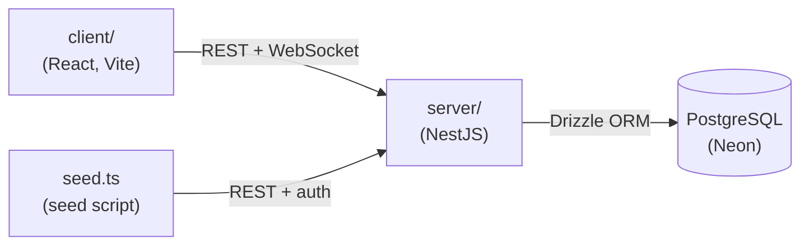

# Sport-EZ

A live sports commentary platform: a NestJS + PostgreSQL backend that streams match scores
and play-by-play commentary over WebSocket, and a React frontend that renders it live.

Built as a portfolio project to demonstrate a full real-time stack — auth, REST, WebSocket
pub/sub, and a seed script that drives the whole pipeline through the real API instead of
mocking any layer.

<!-- Add screenshots or a short screen recording here. -->

## What's actually here

- **REST API** for matches and commentary (list, detail, create, score updates).
- **WebSocket gateway** that pushes live updates to connected clients: new matches, score
  changes, and commentary — scoped per match, so a client only receives commentary for the
  match it's actively watching.
- **Authentication** via [better-auth](https://better-auth.com) (email/password, cookie
  sessions). Reads are public; writes require a session.
- **A seed script** that replays a canned dataset (`server/src/data/data.json`) through the
  real REST API — real HTTP requests, real auth, real database writes — to simulate a live
  feed for demo purposes. Nothing in the pipeline is mocked; only the *content* is scripted.
- **A React client** that lists matches, lets you "watch" one to subscribe to its live feed,
  and renders commentary and score changes as they arrive over WebSocket, with automatic
  reconnect (exponential backoff + jitter) if the connection drops.

## How it works



`seed.ts` authenticates and calls the same REST API `server/` exposes to any client — it
replays `data.json` as a scripted "live" feed, so every write goes through real HTTP, real
auth, and a real database write.

1. The client fetches the current match list and, for whichever match you're watching, its
   commentary history — over plain REST.
2. It opens **one** shared WebSocket connection and sends `{ type: "subscribe", matchId }`
   for the match you're watching.
3. The seed script authenticates against the API and inserts commentary/score updates for
   matches, exactly like a real operator or data feed would.
4. Every write broadcasts an event over the gateway. New matches and score changes go to
   *every* connected client; commentary is scoped to whoever subscribed to that match.
5. The client's WebSocket hook resubscribes automatically after any reconnect — the server
   drops all subscriptions when a socket disconnects, so the client has to re-declare them
   once it's back.

### WebSocket protocol

| Direction | Message | Notes |
|---|---|---|
| server → client | `{ type: "welcome" }` | sent once, on connect |
| server → client | `{ type: "match_created", data: Match }` | broadcast to all clients |
| server → client | `{ type: "score_updated", matchId, data: { homeScore, awayScore } }` | broadcast to all clients |
| server → client | `{ type: "commentary_created", data: Commentary }` | only to clients subscribed to that match |
| server → client | `{ type: "subscribed" \| "unsubscribed", matchId }` | ack for a subscribe/unsubscribe |
| client → server | `{ type: "subscribe" \| "unsubscribe", matchId }` | scope commentary to one match at a time |

## Stack

**Server** — NestJS 11, Drizzle ORM, PostgreSQL, better-auth, `ws` (native WebSocket),
Helmet, class-validator, Jest (+ PGlite for in-memory e2e tests).

**Client** — React 19, Vite, TypeScript, Tailwind CSS v4.

No workspace tooling (no npm/pnpm workspaces, no Turborepo) — `server/` and `client/` are
two independent projects living in one repo, each with its own `package.json`.

## Security — what's done, what isn't

Done:
- Session-based auth (better-auth) with a global guard; only explicitly public routes
  (`@AllowAnonymous()`) skip it.
- Rate limiting on auth endpoints (better-auth's built-in per-route limits).
- Helmet security headers, CORS locked to `ALLOWED_ORIGINS`.
- WebSocket handshake rejects any origin not in `ALLOWED_ORIGINS` (prevents cross-site
  WebSocket hijacking).

Not done (known gaps, not oversights):
- No rate limiting on general business routes (matches/commentary CRUD).
- No bot/abuse protection beyond origin checks.

## Running it yourself

### Prerequisites

- [Bun](https://bun.sh)
- A PostgreSQL database — the free tier of [Neon](https://neon.tech) works fine.

### 1. Clone and configure

```bash
git clone <this-repo-url>
cd sport-ez
```

Copy the example env files and fill them in:

```bash
cp server/.env.example server/.env
cp client/.env.example client/.env
```

`server/.env` needs at minimum:
- `DATABASE_URL` — your Postgres connection string.
- `BETTER_AUTH_SECRET` — generate one with `openssl rand -base64 32`.
- `SEED_EMAIL` / `SEED_PASSWORD` — any credentials; the seed script signs up this user
  automatically if it doesn't exist yet.
- `ALLOWED_ORIGINS` — should include wherever the client will run (default:
  `http://localhost:3000`).

`client/.env` just needs the server's URL, which the defaults already point at
(`http://localhost:8000`).

### 2. Start the server

```bash
cd server
bun install
bun run db:migrate
bun run start:dev
```

The server listens on `http://localhost:8000` and `ws://localhost:8000/ws`.

### 3. Seed some data

In a second terminal:

```bash
cd server
bun run seed
```

This creates a set of "live" matches and streams commentary + score updates for them at a
steady pace (configurable via `DELAY_MS` in `.env`) — this is what makes the demo actually
*look* live.

### 4. Start the client

In a third terminal:

```bash
cd client
bun install
bun run dev
```

Open `http://localhost:3000`, click "Watch Live" on any match, and watch the commentary
feed and score update in real time as the seed script runs.

### Running the tests

```bash
cd server
bun run test        # unit + e2e (uses an in-memory Postgres, no real DB needed)
```

## Project layout

```
sport-ez/
├── server/            NestJS API + WebSocket gateway
│   ├── src/
│   │   ├── routes/    matches, commentary controllers/services
│   │   ├── ws/        WebSocket gateway (subscribe/broadcast logic)
│   │   ├── db/        Drizzle schema + migrations
│   │   ├── auth.ts    better-auth configuration
│   │   └── seed/       seed script (replays data.json through the real API)
│   └── test/          Jest unit + e2e specs
└── client/            React + Vite frontend
    └── src/
        ├── hooks/     useWebSocket (connection), useMatchData (app state)
        ├── components/
        └── services/  REST client
```
